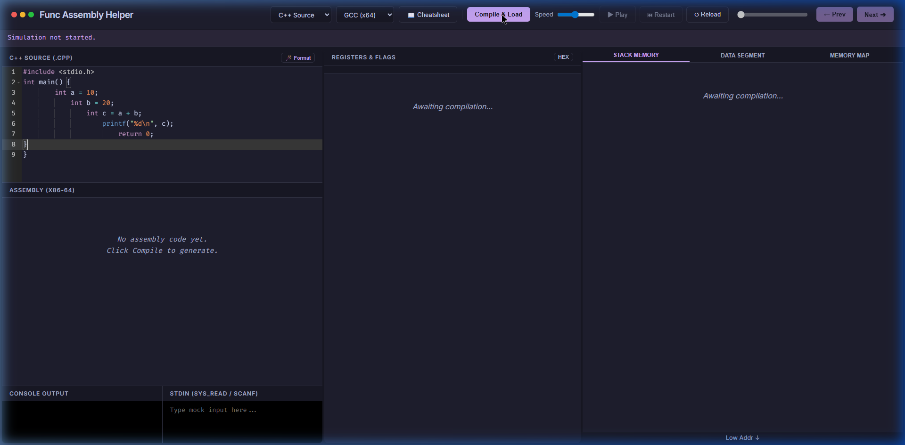
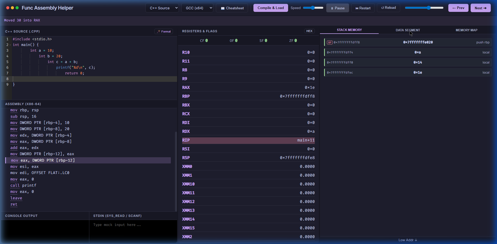
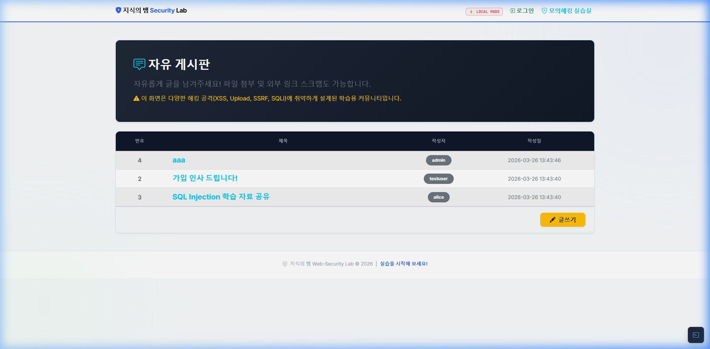
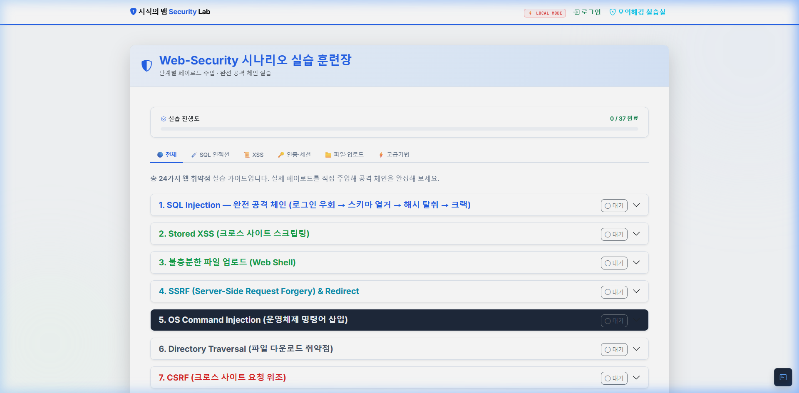

# 🛡️ Practice Hacking Self Server

> **웹 보안 학습 및 어셈블리 시각화를 위한 자체 실습 서버 모음**
> 이 레포지토리는 두 개의 독립적인 Flask 기반 학습 도구를 포함합니다.

> 🤖 **이 레포지토리의 모든 프로젝트는 LLM(Google Gemini)의 도움을 받아 설계 및 구현되었습니다.**

---

## 📦 프로젝트 목록

| 프로젝트 | 설명 | 포트 |
|---|---|---|
| [🔬 func_assembly_helper](./func_assembly_helper/README.md) | C++ → x86-64 어셈블리 인터랙티브 시뮬레이터 | 5000 |
| [🐍 vuln_app](./vuln_app/README.md) | 의도적으로 취약하게 설계된 웹 보안 실습 환경 | 5000 |

---

## 🔬 func_assembly_helper

> C++ 코드를 [Godbolt API](https://godbolt.org)로 컴파일해 어셈블리를 얻고, Python 기반 시뮬레이터로 레지스터·스택 상태를 단계별로 시각화하는 교육용 도구입니다.

| 메인 UI | 스택 메모리 시각화 |
|---|---|
|  |  |

### 주요 기능
- **C++ → Assembly 변환**: GCC / MSVC (x86/x64) 선택 컴파일
- **인터랙티브 시뮬레이터**: Step / Play / Restart 제어
- **레지스터 뷰어**: RAX~R11, XMM0~15, EFLAGS(ZF/SF/CF/OF)
- **스택·데이터 세그먼트 시각화**
- **가상 콘솔 I/O 모킹**: `printf`, `puts`, `syscall` 인터셉트

📖 **[자세히 보기 →](./func_assembly_helper/README.md)**

---

## 🐍 vuln_app — 지식의 뱀 Web Security Lab

> 의도적으로 취약하게 설계된 Flask 웹 앱. 다양한 실제 공격 시나리오를 직접 체험할 수 있는 교육용 환경입니다.

> ⚠️ **경고**: 교육 목적 전용. 실제 서비스 환경에 절대 배포하지 마십시오.

| 메인 게시판 | 취약점 실습 페이지 |
|---|---|
|  |  |

### 구현된 취약점

| 취약점 | 경로 |
|---|---|
| SQL Injection | `/login`, `/register` |
| Stored / Reflected XSS | 게시판, 댓글, `/xss` |
| CSRF | `/change_pw` |
| IDOR | `/profile?user_id=` |
| Unrestricted File Upload | `/post/write` |
| Path Traversal | `/download?file=` |
| OS Command Injection | `/ping` (로컬 모드) |
| SSRF | `/utils/url_preview` |
| Cookie 조작 / JWT 위조 | `role` 쿠키, `jwt_token` |

📖 **[자세히 보기 →](./vuln_app/README.md)**

---

## 📁 레포지토리 구조

```
pratice_hacking_self_server/
├── README.md                          ← 이 파일 (전체 안내)
├── docs/
│   ├── func_assembly_helper/
│   │   └── screenshots/               ← 어셈블리 시뮬레이터 스크린샷
│   └── vuln_app/
│       └── screenshots/               ← 보안 실습 앱 스크린샷
├── func_assembly_helper/
│   ├── README.md                      ← 상세 문서
│   ├── app.py
│   ├── core/
│   │   ├── godbolt.py
│   │   └── simulator.py
│   └── ...
└── vuln_app/
    ├── README.md                      ← 상세 문서
    ├── run.py
    ├── app/routes/
    │   ├── auth.py
    │   ├── board.py
    │   ├── admin.py
    │   └── practice.py
    └── ...
```

---

## 🚀 빠른 시작

### func_assembly_helper
```bash
cd func_assembly_helper
pip install -r requirements.txt
python app.py
# → http://localhost:5000
```

### vuln_app
```bash
cd vuln_app
pip install -r requirements.txt
python init_db.py
python run.py
# → http://localhost:5000
```

> 두 앱을 동시에 실행하려면 `run.py`의 포트를 다르게 설정하세요 (e.g., vuln_app → 5001).

---

## 🤖 AI 활용 안내

이 레포지토리의 모든 프로젝트는 **Google Gemini (LLM)** 와의 협업으로 설계 및 구현되었습니다.

---

## 📄 라이선스

개인 학습·연구·교육 목적으로 자유롭게 사용 가능합니다.
실제 공격에 사용하는 것은 불법입니다.
