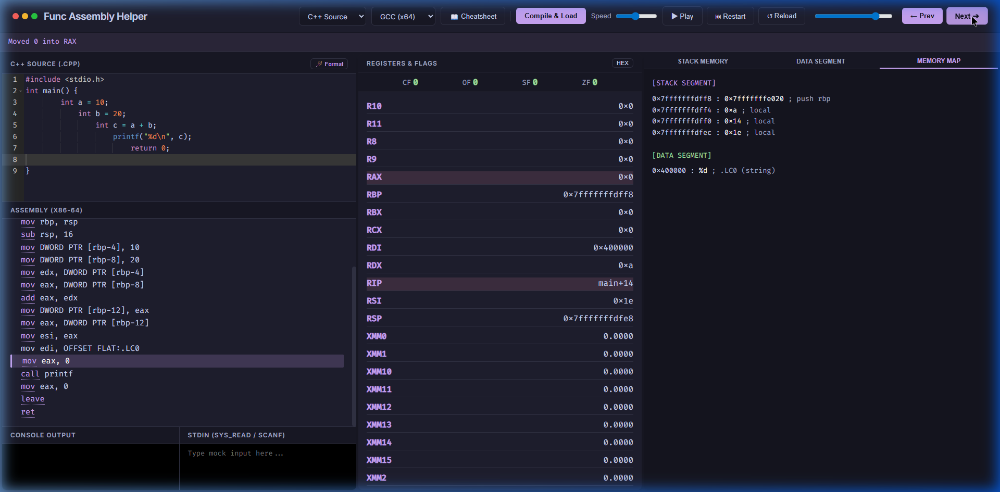

# 🔬 Func Assembly Helper

[← 전체 프로젝트 보기](../README.md)

> **x86-64 어셈블리 인터랙티브 시뮬레이터** — C++ 코드를 어셈블리로 컴파일하고 레지스터·스택 상태를 단계별로 시각화합니다.

> 🤖 **이 프로젝트는 LLM(Google Gemini)의 도움을 받아 설계 및 구현되었습니다.**


---

## ✨ 주요 기능

| 기능 | 설명 |
|---|---|
| **C++ → Assembly 변환** | [Godbolt Compiler Explorer API](https://godbolt.org)를 통해 GCC / MSVC (x86/x64) 어셈블리로 실시간 컴파일 |
| **인터랙티브 시뮬레이터** | Python 기반 x86-64 명령어 실행 엔진. step-by-step / play 모드 지원 |
| **레지스터 뷰어** | RAX, RBX, RCX, RDX, RSI, RDI, RSP, RBP, R8~R11, XMM0~XMM15 실시간 표시 |
| **EFLAGS 추적** | ZF, SF, CF, OF 플래그 상태 실시간 추적 |
| **스택 메모리 시각화** | 주소·값·코멘트를 포함한 스택 프레임 시각화 |
| **데이터 세그먼트 뷰** | `.string`, `.long` 등 정적 데이터 파싱 및 표시 |
| **가상 콘솔 (I/O 모킹)** | `printf`, `puts`, `syscall` (read/write/exit) 인터셉트 및 콘솔 출력 시뮬레이션 |
| **콜 스택 추적** | 함수 호출/리턴 흐름 시각화 |
| **다중 컴파일러 지원** | GCC x86-64, GCC x86-32, MSVC x64, MSVC x86 선택 가능 |
| **stdin 입력 지원** | 커스텀 stdin 데이터를 시뮬레이터에 주입 가능 |

---

## 📸 스크린샷

### 메인 UI — 컴파일 직후


### 시뮬레이션 중 — 스택 메모리 뷰


### 레지스터 & 플래그 뷰


---

## 🛠️ 기술 스택

- **Backend**: Python 3, Flask
- **Frontend**: Vanilla JS, CSS (Ace Editor 에디터 컴포넌트 사용)
- **외부 API**: [Godbolt Compiler Explorer](https://godbolt.org/api)
- **의존성**: `Flask==3.0.0`, `requests==2.31.0`

---

## 🚀 빠른 시작

### 요구사항
- Python 3.8+
- 인터넷 연결 (Godbolt API 사용)

### 설치 및 실행

```bash
# 1. 레포지토리 클론
git clone https://github.com/your-username/pratice_hacking_self_server.git
cd pratice_hacking_self_server/func_assembly_helper

# 2. 의존성 설치
pip install -r requirements.txt

# 3. 서버 실행
python app.py
```

브라우저에서 `http://localhost:5000` 접속

---

## 📡 API 엔드포인트

| 메서드 | 경로 | 설명 |
|---|---|---|
| `GET` | `/` | 메인 시뮬레이터 UI |
| `POST` | `/api/compile_and_simulate` | C++ 코드 컴파일 후 시뮬레이션 상태 반환 |
| `POST` | `/api/simulate_only` | 어셈블리 코드 직접 시뮬레이션 |
| `POST` | `/api/simulate_custom` | C++ 컴파일 → 내부 어셈블리 시뮬레이션 (커스텀) |

### 요청 예시 — `/api/compile_and_simulate`

```json
{
  "code": "#include <stdio.h>\nint main(){\n    int a=10, b=20;\n    printf(\"%d\\n\", a+b);\n    return 0;\n}",
  "compiler": "gcc_x64",
  "options": "-O0",
  "stdin": ""
}
```

### 응답 예시

```json
{
  "assembly": "main:\n  push rbp\n  ...",
  "states": [
    {
      "line": 0,
      "instruction": "Initial State",
      "explanation": "Program entry point",
      "registers": { "RAX": "0", "RSP": "0x7fffffffe000", ... },
      "flags": { "ZF": 0, "SF": 0, "CF": 0, "OF": 0 },
      "stack": [],
      "console_output": "",
      "call_stack": ["main"]
    }
  ]
}
```

---

## ⚙️ 지원 명령어

| 카테고리 | 지원 명령어 |
|---|---|
| **데이터 이동** | `mov`, `movss`, `movsd`, `movaps`, `lea`, `push`, `pop` |
| **산술/논리** | `add`, `sub`, `imul`, `xor`, `and`, `or`, `inc`, `dec` |
| **부동소수점** | `addss`, `subss`, `mulss`, `divss`, `addsd`, `subsd`, `mulsd`, `divsd` |
| **타입 변환** | `cvtsi2ss`, `cvtsi2sd`, `cvttss2si`, `cvttsd2si` |
| **비교/분기** | `cmp`, `test`, `jmp`, `je/jz`, `jne/jnz`, `jl`, `jle`, `jg`, `jge`, `ja`, `jae`, `jb`, `jbe` |
| **함수 호출** | `call`, `ret`, `leave` |
| **시스템** | `syscall` (read=0, write=1, exit=60) |
| **I/O 인터셉트** | `printf`, `puts`, `std::cout` 가상 실행 지원 |

---

## 📁 프로젝트 구조

```
func_assembly_helper/
├── app.py                  # Flask 메인 앱 (라우팅)
├── requirements.txt
├── core/
│   ├── godbolt.py          # Godbolt API 연동 및 어셈블리 파싱
│   └── simulator.py        # x86-64 명령어 시뮬레이션 엔진
├── templates/
│   └── index.html          # 메인 UI (Ace 에디터, 레지스터/스택 뷰)
└── static/
    ├── css/
    └── js/
```

---

## ⚠️ 한계 및 주의사항

- 실제 CPU 에뮬레이션이 아닌 **Python 기반 시뮬레이션** — 복잡한 C++ STL/템플릿은 완전히 재현되지 않을 수 있음
- Godbolt API 호출 시 **인터넷 연결 필요**
- 최대 **500 스텝** 제한 (무한 루프 방지)
- MSVC 어셈블리 일부 패턴은 GCC와 파싱 방식이 다를 수 있음

---

## 🤖 AI 활용 안내

이 프로젝트는 **Google Gemini (LLM)** 와의 협업으로 설계 및 구현되었습니다.

- 시뮬레이터 아키텍처 설계
- `simulator.py` 명령어 파싱 엔진 구현
- Godbolt API 연동 및 어셈블리 필터링 로직
- 프론트엔드 UI/UX 구성

---

## 📄 라이선스

개인 학습·연구 목적으로 자유롭게 사용 가능합니다.

---

[← 전체 프로젝트 보기](../README.md)
