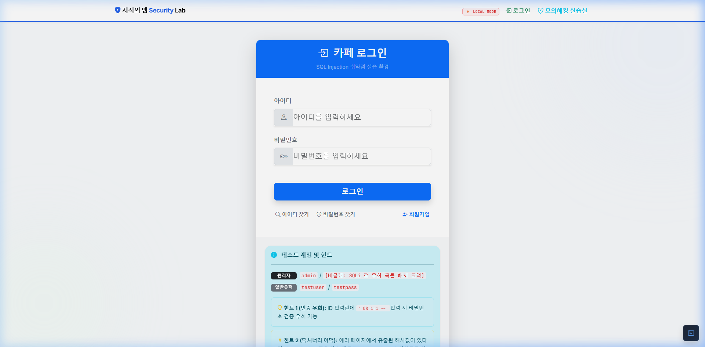
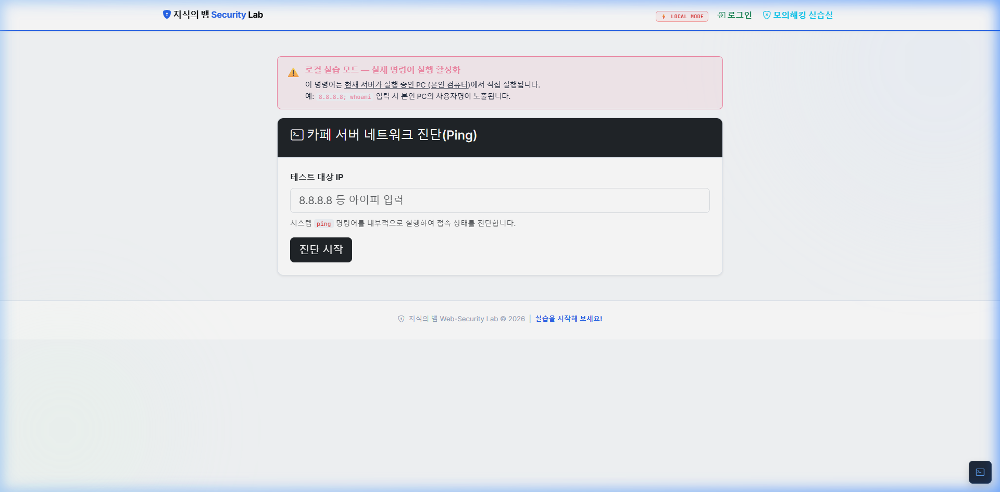

# 🐍 지식의 뱀 — Web Security Lab

[← 전체 프로젝트 보기](../README.md)

> **의도적으로 취약하게 설계된 웹 보안 실습 환경** — SQL Injection, XSS, CSRF, IDOR, File Upload, SSRF, Command Injection 등 다양한 웹 취약점을 직접 실습할 수 있는 Python Flask 기반 웹 앱입니다.

> 🤖 **이 프로젝트는 LLM(Google Gemini)의 도움을 받아 설계 및 구현되었습니다.**

> ⚠️ **경고**: 이 애플리케이션은 **교육 목적**으로만 사용하십시오. 실제 서비스 환경에서 절대 배포하지 마십시오.

---

## 📸 스크린샷

| 메인 게시판 | 로그인 페이지 |
|---|---|
|  |  |

| 취약점 실습 페이지 | OS 명령어 인젝션 실습 |
|---|---|
|  |  |

---

## ✨ 구현된 취약점 목록

| 취약점 | 위치 | 설명 |
|---|---|---|
| **SQL Injection** | `/login`, `/register` | username 파라미터가 쿼리에 직접 삽입 (`' OR '1'='1` 가능) |
| **Stored XSS** | `/post/write`, 댓글 기능 | 게시글 및 댓글 내용이 sanitize 없이 저장·출력 |
| **Reflected XSS** | `/xss?input=` | URL 파라미터가 HTML에 직접 반영 |
| **CSRF** | `/change_pw` | CSRF 토큰 없이 GET 파라미터로도 비밀번호 변경 |
| **IDOR** | `/profile?user_id=` | user_id를 URL 파라미터로 지정 → 다른 사용자 프로필 열람 |
| **Unrestricted File Upload** | `/post/write` | 파일 확장자 화이트리스트 없음 → `.php`, `.py` 업로드 가능 |
| **Path Traversal** | `/download?file=` | `../` 시퀀스로 임의 파일 다운로드 |
| **OS Command Injection** | `/ping` | IP 입력값이 셸 명령어에 직접 삽입 (로컬 모드 한정) |
| **SSRF** | `/utils/url_preview` | 서버가 임의 내부/외부 URL에 HTTP 요청 |
| **Cookie Manipulation** | `role` 쿠키 | `role=admin` 쿠키 조작으로 관리자 권한 획득 |
| **JWT Forgery** | `jwt_token` 쿠키 | 취약한 시크릿 키로 JWT 위조 가능 |
| **MD5 Password Hashing** | 전체 인증 | Salt 없는 MD5 해시 사용 |

---

## 🛠️ 기술 스택

- **Backend**: Python 3, Flask 3.1
- **Database**: SQLite3
- **Auth**: JWT (`PyJWT`), MD5 해시, Session
- **의존성**: `Flask`, `PyJWT`, `lxml`, `PyYAML`

---

## 🚀 빠른 시작

### 요구사항
- Python 3.8+

### 설치 및 실행

```bash
# 1. 레포지토리 클론
git clone https://github.com/your-username/pratice_hacking_self_server.git
cd pratice_hacking_self_server/vuln_app

# 2. 의존성 설치
pip install -r requirements.txt

# 3. 데이터베이스 초기화
python init_db.py

# 4. 서버 실행 (로컬 전용 — Command Injection 실습 활성화)
python run.py
```

브라우저에서 `http://localhost:5000` 접속

### 실행 모드 (run.py)

```python
# 로컬 전용 모드 (기본값) — Command Injection 실습 활성화
HOST = '127.0.0.1'

# 네트워크 공개 모드 — Command Injection 자동 비활성화 (안전)
HOST = '0.0.0.0'
```

---

## 🔑 기본 계정

| 역할 | ID | PW |
|---|---|---|
| 관리자 | `admin` | `admin123` |
| 일반 유저 | `user1` | `password` |

> 💡 `init_db.py` 실행 시 위 계정이 자동 생성됩니다.

---

## 📁 프로젝트 구조

```
vuln_app/
├── run.py                  # 앱 진입점 (HOST 설정)
├── init_db.py              # DB 초기화 스크립트
├── requirements.txt
├── database.db             # SQLite DB
├── app/
│   ├── __init__.py         # Flask 앱 팩토리
│   ├── database.py         # DB 연결 헬퍼
│   └── routes/
│       ├── auth.py         # 로그인/회원가입/프로필/비밀번호 변경
│       ├── board.py        # 게시판 CRUD/댓글/파일 업로드
│       ├── admin.py        # 관리자 대시보드
│       ├── practice.py     # 취약점 실습 (ping/SSRF/다운로드)
│       └── api.py          # REST API
├── templates/              # Jinja2 HTML 템플릿 (22개)
├── static/                 # CSS / JS
└── uploads/                # 업로드 파일 저장 디렉터리
```

---

## 🎯 실습 시나리오

### 1. SQL Injection — 로그인 우회
```
Username: admin' --
Password: anything
```
→ SQL 쿼리: `SELECT * FROM users WHERE username = 'admin' --' AND password = '...'`

### 2. Cookie 조작 — 관리자 권한 획득
브라우저 개발자 도구 → Application → Cookies
```
role = admin
```

### 3. CSRF — 비밀번호 강제 변경
```html

```
로그인된 피해자가 이 페이지를 열면 비밀번호가 변경됨

### 4. IDOR — 타인 프로필 열람
```
GET /profile?user_id=2
```

### 5. OS Command Injection (로컬 모드)
```
Ping IP: 127.0.0.1; whoami
```

### 6. Path Traversal
```
GET /download?file=../../../../etc/passwd
```

---

## 🔒 보안 메모

이 앱은 **화이트박스 학습**을 위해 취약점이 소스 코드 주석으로 명시되어 있습니다.
각 취약 함수에는 `[VULNERABILITY]` 또는 `[VULN]` 태그가 달려 있어 코드 리뷰 학습에도 활용할 수 있습니다.

---

## 🤖 AI 활용 안내

이 프로젝트는 **Google Gemini (LLM)** 와의 협업으로 설계 및 구현되었습니다.

- 취약점 시나리오 설계 및 코드 구현
- Flask Blueprint 기반 라우팅 구조 설계
- 실습 페이지 UI/템플릿 구성
- 주석 기반 의도적 취약점 태깅 (`[VULNERABILITY]`)

---

## 📄 라이선스

교육 목적 전용. 실제 공격에 사용하는 것은 불법입니다.

---

[← 전체 프로젝트 보기](../README.md)
